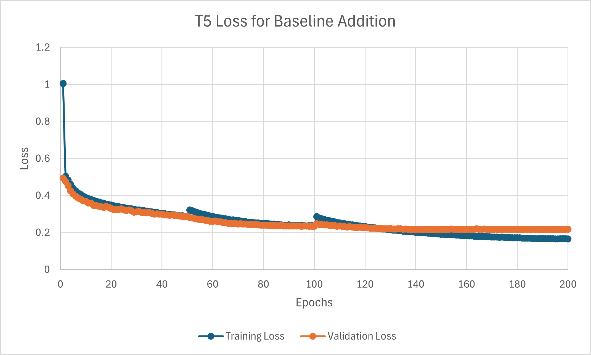
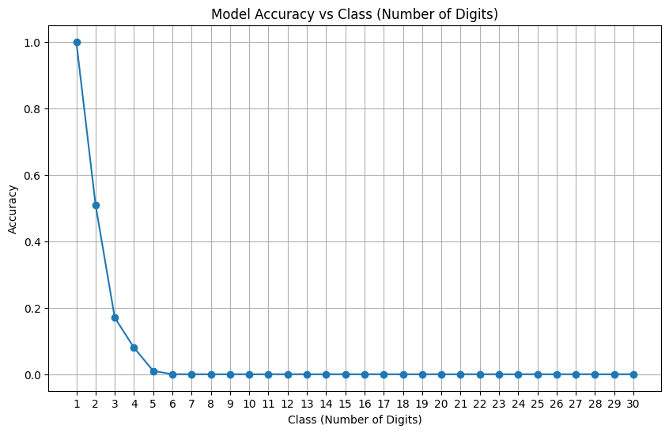
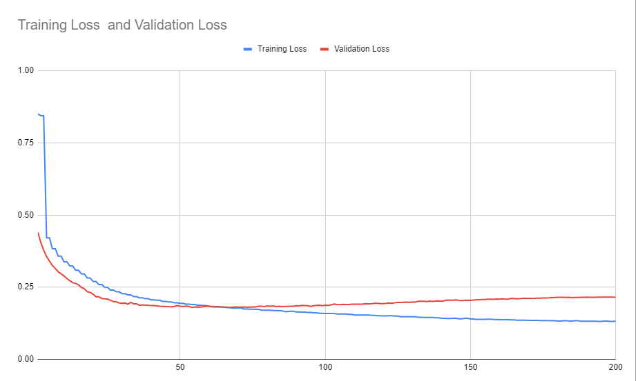
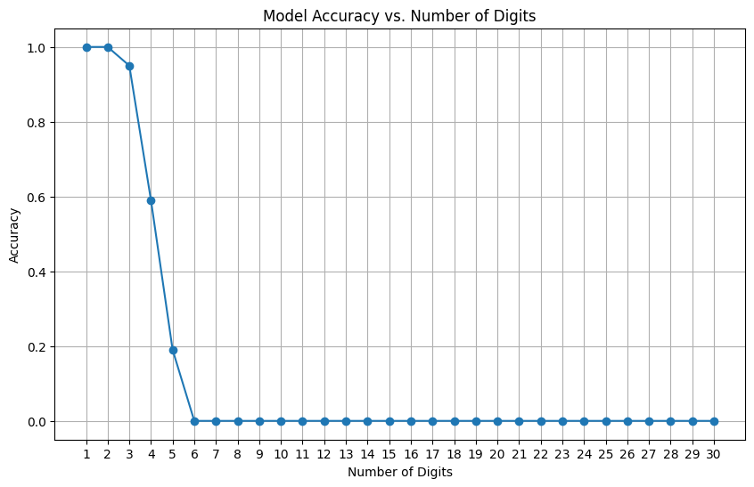

# CS4782-Final-Project-LLMs-and-Arithmetic

<h2 dir="ltr">Baseline Training</h2> 
<ul dir="ltr"> 

</ul> 

<h2 dir="ltr">Baseline Results</h2> 
<ul dir="ltr"> 

</ul> 

<h2 dir="ltr">Baseline Results</h2> 
<ul dir="ltr"> 

</ul> 

<h2 dir="ltr">Baseline Results</h2> 
<ul dir="ltr"> 

</ul> 
